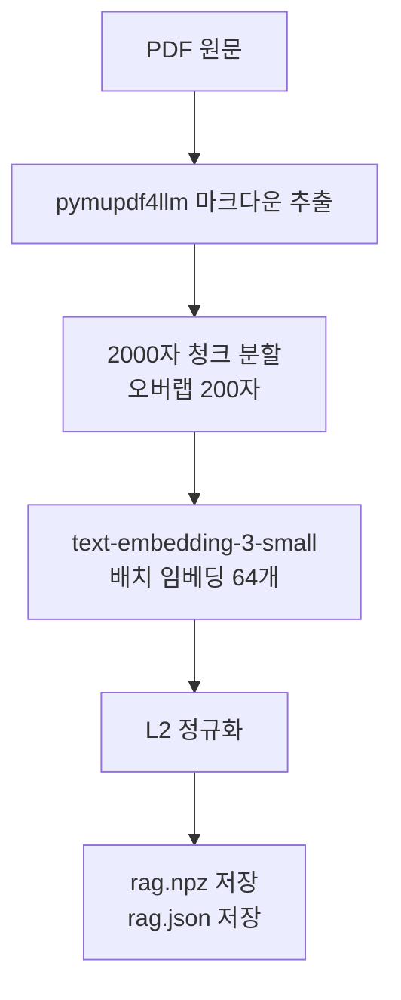
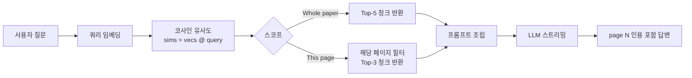
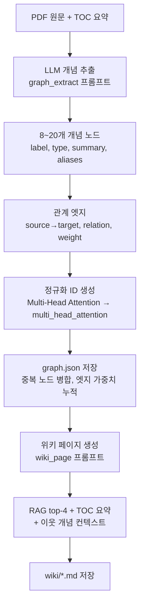
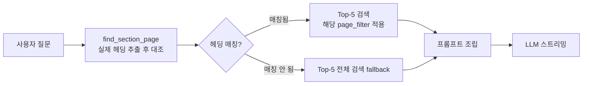

# RAG Chat vs Knowledge Graph Chat: 지식 기반 비교

## 개요

이 프로젝트에는 논문을 이해하기 위한 두 가지 채팅 모드가 있습니다.

| 채팅 모드 | UI 위치 | 지식 원천 |
|-----------|---------|----------|
| **RAG Chat** | 뷰어 3열 (우측 채팅 패널) | PDF 원문 임베딩 벡터 |
| **Knowledge Graph Chat (Wiki QA)** | 사이드바 Wiki 탭 | 지식그래프 노드 + 위키 페이지 + 보조 RAG |

핵심 차이: RAG Chat은 **"논문에 뭐라고 써 있어?"** 를 답하고, Wiki QA는 **"이 개념이 뭐야, 어떤 논문들과 어떻게 연결돼?"** 를 답합니다.

---

## 1. RAG Chat

### 지식 원천

```
data/<paper_id>/
  ├── rag.npz      ← L2 정규화 임베딩 행렬 (N × 1536)
  └── rag.json     ← 청크 텍스트 + 페이지 번호 매핑
```

### 지식 구축 파이프라인



- **청크 크기**: 2,000자 (≈ 500 토큰), 200자 오버랩으로 문맥 연속성 유지
- **임베딩 모델**: `text-embedding-3-small` (1,536차원)
- **LLM 없이** 자동 구축 — PDF만 있으면 즉시 인덱싱 가능
- 관련 코드: [rag.py](../rag.py) `build_index()` (line 34)

### 검색 및 답변 흐름



- **Whole paper 모드**: 전체 논문에서 코사인 유사도 상위 5개 청크 검색
- **This page 모드**: 현재 보고 있는 페이지로 필터링 후 상위 3개 청크 (8,000자 미만이면 전체 페이지 사용)
- 관련 코드: [rag.py](../rag.py) `RagIndex.topk()` (line 80), [ai.py](../ai.py) `chat_stream()` (line 71)

### 시스템 프롬프트 방침

> *"Answer the user's question using ONLY the provided paper excerpts as ground truth. Cite supporting pages inline as [page N]."*

원문 발췌만을 근거로 삼고, 벗어난 내용은 "없다"고 답함. (`prompts/chat.system.txt`)

### 답변 특성

- 원문에 가장 가까운 발췌 중심 응답
- 인용 형식: `[page 5]`, `[page 12]`
- 논문 1편 범위로 한정 (per-paper 인덱스)
- Mermaid 다이어그램으로 아키텍처 설명 가능

---

## 2. Knowledge Graph Chat (Wiki QA)

### 지식 원천

```
data/<paper_id>/
  ├── graph.json        ← 개념 노드 + 관계 엣지 (논문 간 공유)
  └── wiki/
      ├── index.md      ← 전체 개념 목록
      ├── transformer.md
      ├── multi_head_attention.md
      └── [concept_id].md  ← 개념별 위키 페이지
```

### 지식 구축 파이프라인



- **LLM 기반** 명시적 개념·관계 추출 — 인덱싱보다 비용이 높음
- 논문 간 같은 개념 노드가 **통합**됨 (예: `transformer` 노드가 여러 논문을 추적)
- 관련 코드: [graph.py](../graph.py) `extract_concepts()`, [wiki.py](../wiki.py) `generate_page()` (line 210)

### 검색 및 답변 흐름

```mermaid
flowchart LR
    Q[사용자 질문] --> M[키워드 매칭\nnodes label/summary]
    M --> N{매칭 노드}
    N -- 있음 --> TOP[상위 5개 노드]
    N -- 없음 --> FB[그래프 첫 5개 노드]
    TOP --> W[위키 페이지 로드\nwiki/*.md]
    W --> R[보조 RAG 검색\nall papers top-3]
    R --> P[프롬프트 조립\n위키 + RAG + 대화이력]
    P --> L[LLM 스트리밍]
    L --> A[개념 인용 답변\n[[concept]] + paper_id p.N]
```

- 관련 코드: [wiki.py](../wiki.py) `wiki_qa_stream()` (line 299)

### 시스템 프롬프트 방침

> *"Answer the user's question using ONLY the provided wiki context and paper excerpts. Cite concepts using their wiki page names inline as [[concept]]."*

구조화된 개념 지식을 1차 근거로, RAG 발췌를 보조로 사용. (`prompts/wiki_qa.system.txt`)

### 답변 특성

- 개념 정의, 유형, 관련 개념까지 포함한 심층 응답
- 인용 형식: `[[multi_head_attention]]`, `[attentionisallyouneed, p. 5]`
- **다중 논문** 횡단 가능 (노드가 여러 논문을 추적)
- 위키 페이지 내 이웃 개념(`[[concept]]`) 링크로 탐색 가능

---

## 3. 핵심 비교표

| 항목 | RAG Chat | Knowledge Graph Chat |
|------|----------|----------------------|
| **지식 저장 형태** | 벡터 임베딩 + 원문 청크 | 구조화 그래프 노드/엣지 + 위키 마크다운 |
| **지식 추출 방법** | 자동 청크 분할 (LLM 불필요) | LLM이 개념·관계를 명시적으로 추출 |
| **검색 방식** | 시맨틱 유사도 (코사인) | 키워드 매칭 → 위키 페이지 로드 + 보조 RAG |
| **검색 범위** | 논문 1편 (per-paper 인덱스) | 논문 횡단 (노드가 다중 논문 추적) |
| **컨텍스트 구성** | 원문 발췌 5개 청크 | 위키 페이지 + RAG 발췌 + 이웃 개념 |
| **답변 깊이** | 원문 발췌 중심 | 개념 정의·관계·요약 중심 |
| **인용 형식** | `[page N]` | `[[concept]]`, `[paper_id, p. N]` |
| **다중 논문 지원** | 별도 인덱스, 연결 안 됨 | 개념 노드에서 논문 간 연결 |
| **구축 비용** | 저비용 (임베딩 API만) | 고비용 (LLM 추출 + 위키 생성) |
| **구축 선행 조건** | `run.py` 실행 후 즉시 | `wiki ingest` 추가 실행 필요 |
| **섹션 질문 처리** | 실제 헤딩 추출 → 매칭 시 해당 페이지 자동 필터 | 노드 매칭 실패 시 첫 5개 노드 fallback |

---

## 4. 지식 구조 비교

### RAG Chat의 지식 구조

```
원문: "The Transformer uses stacked self-attention and point-wise, 
       fully connected layers for both the encoder and decoder." [page 1]

→ 청크로 저장, 질문과 유사한 청크를 꺼내 그대로 제시
→ 지식이 비정형(flat text)으로 저장됨
```

### Knowledge Graph Chat의 지식 구조

```
노드: {
  "id": "transformer",
  "label": "Transformer",
  "type": "architecture",
  "summary": "Sequence-to-sequence architecture using only attention...",
  "papers": ["attentionisallyouneed", "autogen"]
}

엣지: transformer --[uses]--> multi_head_attention (weight: 2)
엣지: transformer --[uses]--> positional_encoding (weight: 1)

→ 구조화된 개념 그래프로 저장
→ 개념 간 관계를 명시적으로 탐색 가능
```

---

## 5. RAG Chat 한계 및 개선: 섹션 키워드 감지

### 문제: "summarize abstract" 질문 실패

RAG Chat에서 `"summarize abstract"`라고 물으면 답변을 못 하는 경우가 있습니다.

**원인**: 쿼리 임베딩이 **"요약하다"는 행위**에 가깝고, abstract 본문 내용 벡터와 코사인 유사도가 낮음 → 관련 없는 청크가 상위에 선택됨 → 시스템 프롬프트 방침("없으면 없다고 답하라")에 따라 답변 불가.

Wiki QA가 같은 질문에 답할 수 있는 이유는 노드 매칭 실패 시 **그래프 첫 5개 노드를 자동 fallback**([wiki.py:328](../wiki.py#L328))하기 때문으로, 의도된 동작이 아니라 우연한 구제입니다.

### 해결: 실제 헤딩 추출 기반 섹션 매칭

> **주의 — 첫 시도 실패**: 처음엔 `# abstract` 같은 고정 키워드를 청크에서 찾는 방식이었으나, 실제 추출된 헤딩은 `## **Abstract**`, `## **1 Introduction**`, `## **7 Conclusion**`처럼 **bold(`**`) + 섹션 번호**가 붙어 있어 단순 문자열 매칭이 **7개 논문 전부에서 하나도 매칭되지 않았습니다**. 그래서 고정 키워드 대신 **논문에 실제 존재하는 헤딩을 추출해 질문과 대조**하는 일반적 방식으로 다시 구현했습니다.

핵심 아이디어: 미리 정해둔 섹션 목록이 아니라, **각 논문의 마크다운 헤딩을 모두 추출·정규화**한 뒤 사용자 질문에 그 헤딩 이름이 등장하면 해당 페이지로 필터링합니다. 따라서 abstract뿐 아니라 `Multi-Head Attention`, `Predictable Scaling` 등 **임의의 섹션**, 모든 논문에서 동작합니다.

**추가된 코드** ([rag.py](../rag.py))

```python
# 헤딩 한 줄: '#' 1~6개 + (bold/번호 포함) 제목
_HEADING_RE = re.compile(r"^#{1,6}\s+(.+?)\s*$", re.MULTILINE)
# 앞쪽 섹션 번호 제거: "1", "7.2", "A.", "IV)" 등
_NUMBERING_RE = re.compile(r"^[\dIVXLivxl]+(?:\.\d+)*[.)]?\s+")

def _clean_heading(raw: str) -> str:
    """'## **1 Introduction**' -> 'Introduction', '**Abstract**' -> 'Abstract'"""
    s = raw.replace("*", "").replace("`", "").strip()
    s = s.strip("_").strip()          # italic 마커 제거
    return _NUMBERING_RE.sub("", s).strip()

class RagIndex:
    def sections(self) -> list[dict]:
        """청크에서 모든 마크다운 헤딩 추출 → [{"page", "title"}] (제목 기준 dedup)"""
        ...

    def find_section_page(self, query: str) -> dict | None:
        """질문에 실제 헤딩 이름이 등장하면 가장 구체적인(긴) 매칭의 {page, title} 반환"""
        q = query.lower()
        best = None
        for sec in self.sections():
            title = sec["title"].lower()
            if re.search(rf"\b{re.escape(title)}\b", q):
                if best is None or len(title) > len(best["title"]):
                    best = sec
        return best
```

[ai.py](../ai.py) `chat_stream`은 whole-paper 스코프일 때 `index.find_section_page(message)`를 호출해, 매칭되면 그 페이지로 `page_filter`를 걸어 top-5 검색합니다.

**검색 흐름**



**실측 결과** (7개 논문 대상 검증)

| 질문 예시 | 매칭된 헤딩 → 동작 |
|----------|-------------------|
| "summarize abstract" | Abstract 헤딩이 있는 5개 논문에서 해당 페이지로 필터 |
| "what does the introduction say" | 7개 논문 모두 Introduction 페이지로 필터 |
| "explain the conclusion" | Conclusion 헤딩 보유 논문에서 해당 페이지로 필터 |
| "what is attention?" (헤딩 아님) | 매칭 없음 → 전체 논문 top-5 검색 (fallback) |

> **남은 한계**: ① abstract가 별도 헤딩 없이 제목 아래 본문으로 들어간 논문(예: agent_builder)은 매칭되지 않고 fallback됩니다. ② "intro", "summary" 같은 비공식 표현은 실제 헤딩("Introduction", "Conclusion")과 글자가 달라 매칭되지 않습니다. 정확한 섹션명을 쓰면 항상 동작합니다.

---

## 6. 활용 가이드

| 상황 | 추천 채팅 |
|------|----------|
| "논문 몇 페이지에서 attention을 어떻게 설명했어?" | **RAG Chat** |
| "지금 보고 있는 이 페이지 내용 설명해줘" | **RAG Chat (This page 모드)** |
| "Multi-Head Attention이 정확히 뭐야?" | **Wiki QA** |
| "Transformer와 관련된 개념들이 뭐가 있어?" | **Wiki QA** |
| "이 개념이 다른 논문에서는 어떻게 쓰여?" | **Wiki QA** (다중 논문 추적) |
| "수식 (1)번이 무슨 의미야?" | **RAG Chat** |
| "abstract 요약해줘" | **RAG Chat** (섹션 감지 → abstract 페이지 자동 필터) |
| "conclusion에서 뭐라고 했어?" | **RAG Chat** (섹션 감지 → conclusion 페이지 자동 필터) |

---

## 7. 관련 코드 파일 요약

| 파일 | 역할 |
|------|------|
| [rag.py](../rag.py) | 청크 분할, 임베딩, 코사인 유사도 검색 |
| [graph.py](../graph.py) | LLM 개념 추출, 그래프 CRUD |
| [wiki.py](../wiki.py) | 위키 페이지 생성·로드, Wiki QA 스트리밍 |
| [ai.py](../ai.py) | RAG Chat 스트리밍 (`chat_stream`) |
| [prompts/chat.system.txt](../prompts/chat.system.txt) | RAG Chat 시스템 프롬프트 |
| [prompts/wiki_qa.system.txt](../prompts/wiki_qa.system.txt) | Wiki QA 시스템 프롬프트 |
| [prompts/graph_extract.system.txt](../prompts/graph_extract.system.txt) | 개념 추출 프롬프트 |
